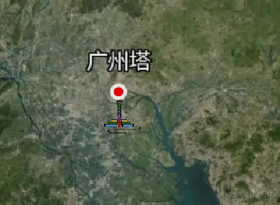
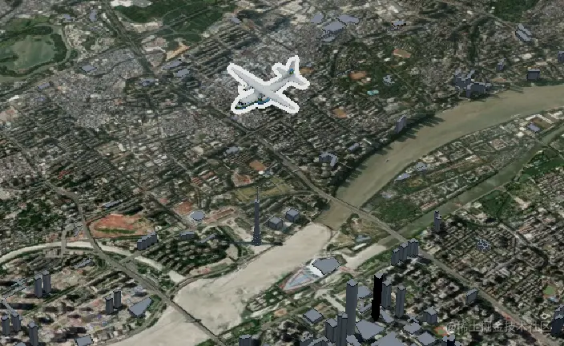

> 之前零零碎碎学过、用过cesium，但也没做记录，现在重新整理一下，方便学习回顾。

# 1.cesium简介

CesiumJS是一个开源JavaScript库，用于创建具有最佳性能、精度、视觉质量和易用性的世界级3D地球仪和地图。从航空航天到智能城市再到无人机，各行各业的开发人员都使用CesiumJS创建交互式Web应用程序来共享动态地理空间数据。
cesium官网链接
可以在官网下载cesium 的源码，也可以用npm下载依赖包

```js
npm install cesium
```

# 2.vue中使用cesium

# 3.天空盒子

# 4.地图加载

# 5.地形的加载

# 6.坐标系与转换

# 7.相机

# 8.添加物体

### 8.1 添加点

使用entities.add，添加一个点实体，并配置好点的位置、大小、颜色等信息。

```js
var point = viewer.entities.add({
    // 定位点
    position: Cesium.Cartesian3.fromDegrees(113.3191, 23.109, 700),
    // 点
    point: {
      pixelSize: 10,
      color: Cesium.Color.RED,
      outlineColor: Cesium.Color.WHITE,
      outlineWidth: 4,
    },
  });
```

### 8.2 添加一个文字标签

还是使用entities的add方法，来添加物体，其中label代表文字部分，在配置项中设置好相关属性；billboard是广告牌的意思，可以显示图片图标。

```js
// 添加文字标签和广告牌
  var label = viewer.entities.add({
    position: Cesium.Cartesian3.fromDegrees(113.3191, 23.109, 750),
    label: {
      text: "广州塔",
      font: "24px sans-serif",
      fillColor: Cesium.Color.WHITE,
      outlineColor: Cesium.Color.BLACK,
      outlineWidth: 4,
      // FILL填充文字，OUTLINE勾勒标签，FILL_AND_OUTLINE填充文字和勾勒标签
      style: Cesium.LabelStyle.FILL_AND_OUTLINE,
      // 设置文字的偏移量
      pixelOffset: new Cesium.Cartesian2(0, -24),
      // 设置文字的显示位置,LEFT /RIGHT /CENTER
      horizontalOrigin: Cesium.HorizontalOrigin.CENTER,
      // 设置文字的显示位置
      verticalOrigin: Cesium.VerticalOrigin.BOTTOM,
    },
    billboard: {
      image: "./texture/gzt.png",
      width: 50,
      height: 50,
      // 设置广告牌的显示位置
      verticalOrigin: Cesium.VerticalOrigin.TOP,
      // 设置广告牌的显示位置
      horizontalOrigin: Cesium.HorizontalOrigin.CENTER,
    },
  });
```

效果如下：



## 8.3 添加飞机模型

```js
// 添加3D模型
const airplane = viewer.entities.add({
    name: "Airplane",
    position: Cesium.Cartesian3.fromDegrees(113.3191, 23.109, 1500),
    model: {
            uri: "./model/Air.glb",
            // 设置飞机的最小像素
            minimumPixelSize: 128,
            // 设置飞机的轮廓
            silhouetteSize: 5,
            // 设置轮廓的颜色
            silhouetteColor: Cesium.Color.WHITE,
            // 设置相机距离模型多远的距离显示
            distanceDisplayCondition: new Cesium.DistanceDisplayCondition(
                    0,
                    200000
            ),
    },
});
```



## 8.4 添加一个矩形

传入2个点位参数，就能添加矩形

```js
  // 使用entity创建矩形
  var rectangle = viewer.entities.add({
    rectangle: {
      coordinates: Cesium.Rectangle.fromDegrees(
        // 西边的经度
        90,
        // 南边维度
        20,
        // 东边经度
        110,
        // 北边维度
        30
      ),
      material: Cesium.Color.RED.withAlpha(0.5),
    },
  });
```

# 9.entity实体

# 10.primitive图元

# 11

[传送门](https://juejin.cn/post/7259208528531324985?from=search-suggest)
